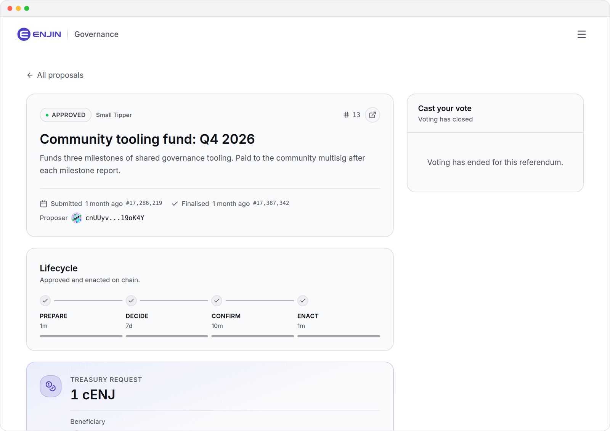
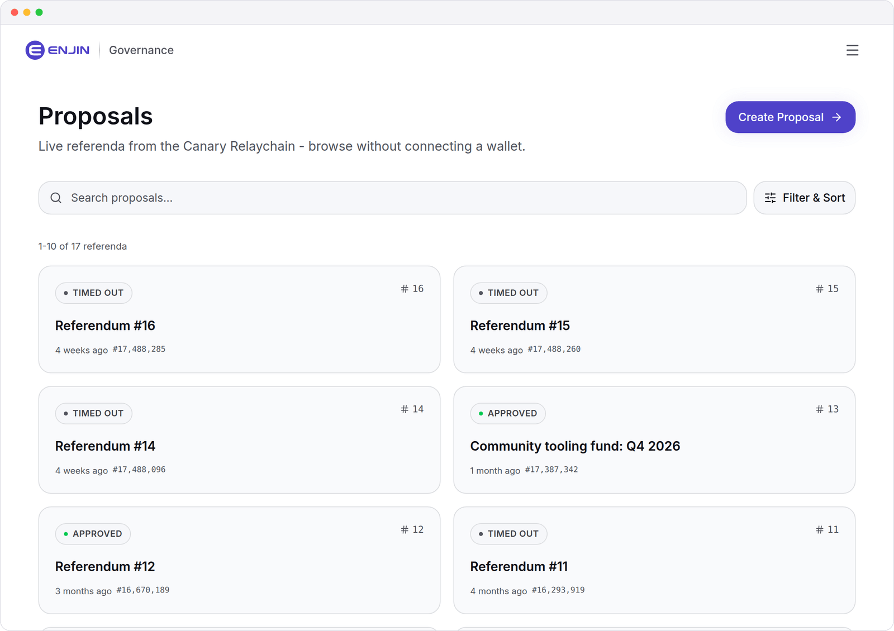
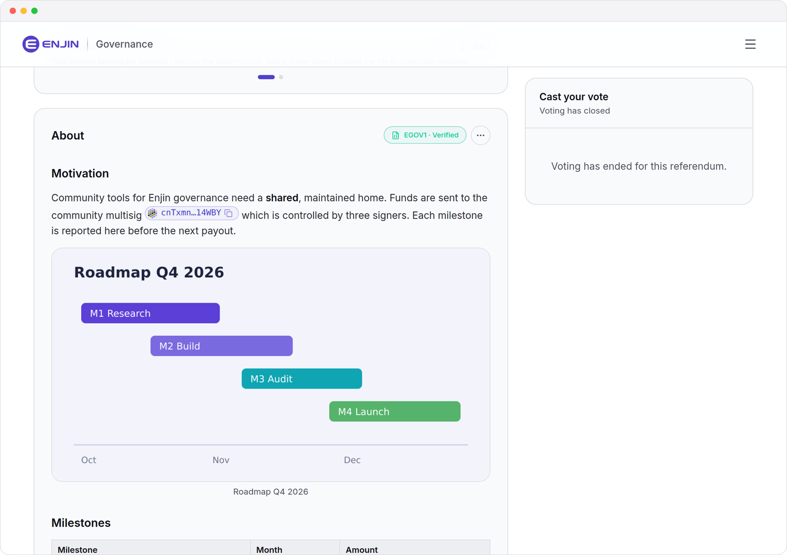
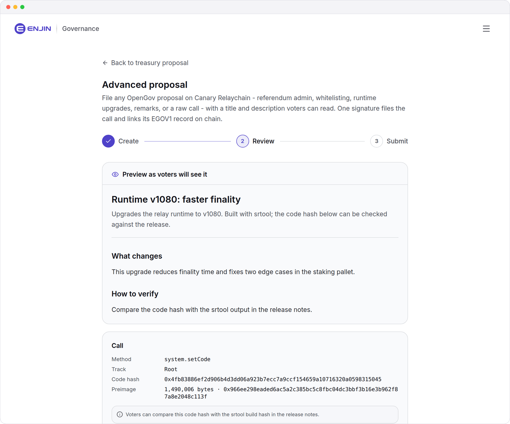
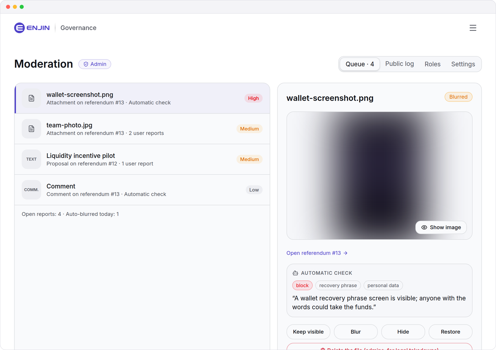
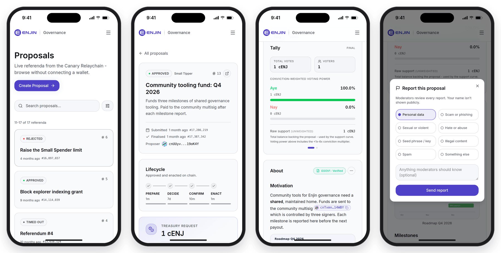
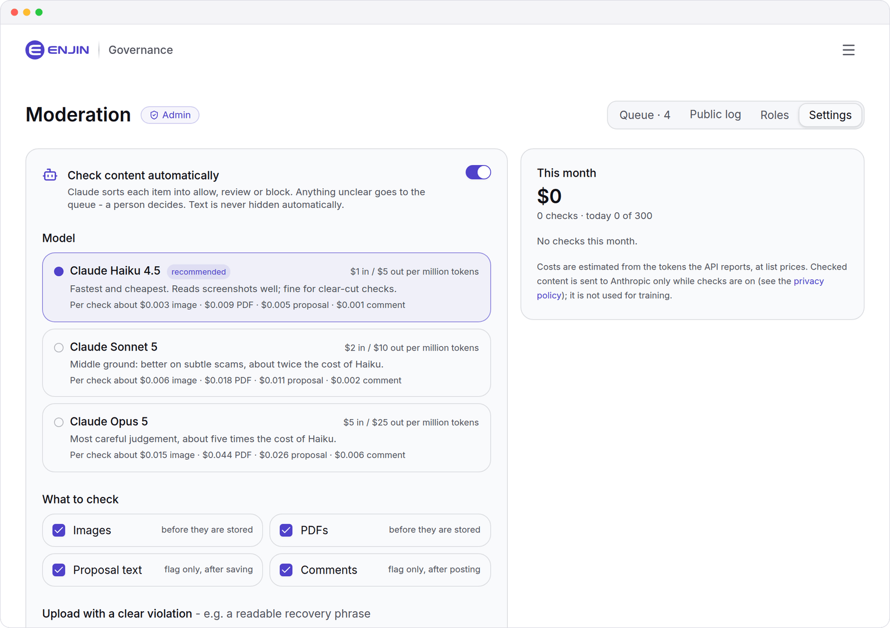

<p align="center">
  
</p>

<h1 align="center">Enjin Governance</h1>

<p align="center">
  <b>The web client for <a href="https://docs.enjin.io/">Enjin OpenGov</a>.</b><br/>
  Browse referenda, vote with conviction, file treasury and admin proposals,
  discuss them and keep the space clean - from the browser, backed by live chain RPC.
</p>

<p align="center">
  <a href="https://github.com/chriszemmel/enjin-governance/actions/workflows/ci.yml"></a>
  
  <a href="LICENSE"></a>
  
  
  
  
</p>

<p align="center">
  <a href="https://gov.enjin.cloud"><b>gov.enjin.cloud</b></a> ·
  <a href="#quick-start">Quick start</a> ·
  <a href="docs/ARCHITECTURE.md">Architecture</a> ·
  <a href="#the-egov1-metadata-standard">EGOV1</a> ·
  <a href="#moderation">Moderation</a> ·
  <a href="#changelog">Changelog</a>
</p>

<p align="center">
  <picture>
    <source media="(prefers-color-scheme: dark)" srcset="docs/screenshots/proposal-dark.png" />
    
  </picture>
</p>

> Independent, community-maintained interface for Enjin on-chain governance,
> developed and maintained by Chris Zemmel. The domain is provided by Atlas
> Development Services, a core contributor to the Enjin Blockchain, whose
> developers occasionally contribute to this project.

---

## At a glance

<table>
  <tr>
    <td width="33%" valign="top"><b>Read the chain</b><br/>Referenda, tallies, voters and history straight from Enjin's RPC and archive nodes. No indexer required.</td>
    <td width="33%" valign="top"><b>Vote and delegate</b><br/>Conviction voting, delegation per track or across all, lock and deposit reclaims. Six wallets, including Enjin Wallet.</td>
    <td width="33%" valign="top"><b>Propose</b><br/>Treasury requests and admin calls - runtime upgrades, cancels, whitelists, raw calls - in one signature each.</td>
  </tr>
  <tr>
    <td valign="top"><b>Write for voters</b><br/>Markdown, inline images, PDFs and checksum-validated address chips, with a live preview of what voters will see.</td>
    <td valign="top"><b>Verifiable records</b><br/>Every proposal's text is pinned on chain with an EGOV1 hash, so anyone can check it hasn't been swapped.</td>
    <td valign="top"><b>Moderation built in</b><br/>Reports, a review queue, roles by wallet, a public log and optional AI pre-checks with a hard daily cost cap.</td>
  </tr>
</table>

## Screenshots

<table>
  <tr>
    <td width="50%" valign="top">
      <picture>
        <source media="(prefers-color-scheme: dark)" srcset="docs/screenshots/proposals-dark.png" />
        
      </picture>
      <p align="center"><sub><b>Proposals</b> - live referenda, browsable without a wallet</sub></p>
    </td>
    <td width="50%" valign="top">
      <picture>
        <source media="(prefers-color-scheme: dark)" srcset="docs/screenshots/proposal-text-dark.png" />
        
      </picture>
      <p align="center"><sub><b>Proposal text</b> - Markdown, images, address chips, EGOV1-verified</sub></p>
    </td>
  </tr>
  <tr>
    <td width="50%" valign="top">
      <picture>
        <source media="(prefers-color-scheme: dark)" srcset="docs/screenshots/advanced-dark.png" />
        
      </picture>
      <p align="center"><sub><b>Advanced proposals</b> - a runtime upgrade, reviewed before signing</sub></p>
    </td>
    <td width="50%" valign="top">
      <picture>
        <source media="(prefers-color-scheme: dark)" srcset="docs/screenshots/moderation-dark.png" />
        
      </picture>
      <p align="center"><sub><b>Moderation</b> - one queue for reports and automatic checks</sub></p>
    </td>
  </tr>
</table>

<p align="center">
  <picture>
    <source media="(prefers-color-scheme: dark)" srcset="docs/screenshots/phones-dark.png" />
    
  </picture>
  <br/><sub>Every page works on a phone.</sub>
</p>

<sub>Screenshots show test data on Canary.</sub>

## Contents

- [Features](#features)
- [Quick start](#quick-start)
- [Stack](#stack) · [Scripts](#scripts) · [Project structure](#project-structure)
- [The EGOV1 metadata standard](#the-egov1-metadata-standard)
- [Documentation](#documentation) · [Vercel deploy](#vercel-deploy)
- [Moderation](#moderation) · [Networks](#networks)
- [Contributing](#contributing) · [Changelog](#changelog) · [License](#license)

---

## Features

### Read the chain

- **Live chain reads** - referenda, tracks, tally, deposits, preimages
  streamed from Enjin's primary RPC plus a dedicated archive endpoint
  (`wss://archive.relay.{blockchain,canary}.enjin.io`) for historical
  state. Four-tier proposal-call sourcing: live state → archive
  history → on-chain `preimage.preimageFor` (with `len`-recovery scan) →
  Subscan enrichment as a last-resort fallback. Canary works with zero
  Subscan dependency.
- **Chain-sourced voter list** - every voter on a referendum read from
  `convictionVoting.votingFor.entries()` (per-vote currency pulled from the
  multi-token vote storage for ENJ vs sENJ pools), via the archive RPC at
  `finalisation_block - 1` for terminal refs. No indexer in the loop.
- **Participation graph** - stacked aye/nay distribution bar where each
  voter is one segment proportional to their conviction-weighted power,
  plus a conviction histogram showing how the vote was spread across
  the 0.1x-6x tiers. "One whale or many holders" at a glance.
- **Lifecycle progress** - visual prepare/decide/confirm timeline,
  decision-deposit awaiting state, time-elapsed badges.
- **Conviction voting** - lock durations come from the runtime's
  vote-locking period (the same on every track), never hardcoded.

### Write to the chain

- **Multi-wallet** - Enjin Wallet (WalletConnect QR / mobile deep link),
  generic WalletConnect, plus the four major Polkadot browser extensions
  (Polkadot.js, Talisman, SubWallet, PolkaGate). Uninstalled wallets are
  greyed out with a one-click install link. Account picker shown on
  connect when the session carries more than one account, so a
  multi-account wallet never silently binds to the first account.
- **Real signing** - `useExtrinsic` wraps build → sign → broadcast →
  finalise with toast progress and human-readable module-error decoding.
  Routes governance calls through the runtime's multi-token `convictionVoting`
  fork (and `voteManager` on runtimes that have it), probing metadata for
  the right call arity so the per-vote `currency` arg is never dropped.
- **Unified sign-request UX** - every signature (vote, treasury submit,
  sign-in) flows through the same modal that the connect QR uses, so
  WalletConnect sessions never get a stale prompt and the wake/redirect
  always targets the right peer.
- **Treasury proposals end to end** - create wizard batches `preimage.notePreimage`
  + `referenda.submit` + `preimage.notePreimage(envelope)` +
  `referenda.setMetadata` via `utility.batchAll`. The referendum's
  `MetadataOf` binding carries an `EGOV1:{"u":"…","h":"…"}` envelope so any
  third party can rebuild the proposal corpus by resolving it through the
  preimage pallet. Auto-picks the smallest origin tier that covers the amount (capped
  at TreasuryAdmin / 25,000,000 ENJ); the beneficiary can be any address, and the
  enactment moment is selectable (as-soon-as-possible / delay / at a block).
- **General + admin proposals** - a separate `/create/advanced` composer files
  any proposal under a chosen track origin: cancel / kill a referendum,
  whitelist a call, authorize a runtime upgrade by wasm hash
  (`system.authorizeUpgrade`), on-chain remark, or a raw SCALE call. Small
  calls ride inline; larger ones are noted as a preimage automatically. The
  title / summary / body is anchored with the same EGOV1 `setMetadata`
  binding as treasury proposals.
- **Delegation** - delegate conviction-weighted ENJ on one track or batch
  across all eligible tracks in a single signature, and undelegate per track.
- **Account governance state** - reclaim reserved deposits (submission /
  decision / preimage) and free conviction locks from `/account`.
- **Resumable drafts** - proposal JSON + media land in R2 before the
  user signs anything. If they bail out, the wizard offers to resume,
  edit, or delete the draft on `/account`. Drafts can be submitted
  later with the same confirmation flow as a fresh proposal. An unsigned
  draft is updated in place when it is staged again, never duplicated.
- **Wrong-network guard** - an address from another network (for example
  a Matrixchain `ef…` address in a Relay proposal) is caught before
  signing; the composer offers to convert it and the server re-checks
  the beneficiary.

### Writing proposals

- **Rich proposal text** - a small, safe Markdown subset with headings,
  lists, tables, code, links and inline images from the proposal's own
  attachments. SS58 addresses render as compact, checksum-validated
  chips. A live preview shows exactly what voters will see.
- **Images and PDFs** - drag-and-drop uploads of up to 4 MB each (the
  request limit on Vercel); larger photos are shrunk in the browser
  first. Images are re-encoded (metadata such as GPS stripped), get WebP
  thumbnails and open in a viewer. Proposers can remove their own
  attachments at any time.
- **Attachment details checked** - the size, type and hash written into
  a proposal's JSON must match the stored file, and file names lose
  characters that could disguise them.
- **Advanced proposals with a record** - proposals from
  `/create/advanced` carry a title, description and an EGOV1 record like
  treasury proposals; EGOV1 1.2.0 adds the optional `call` and
  `enactment` sections so the enacted call is documented next to the
  text.

### Moderation tools

- **Reports and one review queue** - anyone signed in can report a
  proposal, an image or a comment. Moderators keep, blur, hide or restore
  content; admins can also delete files and pause posting for a wallet.
  Every decision needs a reason and is listed in the public
  `/moderation-log`. On-chain data and proposal JSON are never changed.
- **Roles by wallet** - admins come from `GOVERNANCE_ADMIN_PUBLIC_KEYS`;
  they grant moderator or admin roles in `/moderation`. Roles are keyed
  by public key, so they hold on every network prefix.
- **Optional automatic checks** - with an Anthropic API key, uploads and
  text can be checked by an AI model before moderators see them. Admins
  choose the model, what is checked, how clear violations are handled
  and a daily limit, and see this month's usage and cost. Text is only
  ever flagged for a human, never hidden automatically. See
  [Moderation](#moderation).
- **Status page for admins** - Moderation → Status checks the setup
  after a deploy: database and migrations, storage and the public URL,
  the rate-limit store, Telegram (with a test message), the automatic
  checks and the legal details. A check that fails because of the setup
  (bad key, retired model, no credit left) shows there and is reported
  to the moderators' Telegram chat once a day.
- **Backups** - admins download one ZIP with the database, a restore
  script, every proposal JSON file and, if they like, all uploaded files.
  It is built in R2 and fetched through a link valid for five minutes;
  the newest five are kept. See
  [`docs/HANDOVER.md`](docs/HANDOVER.md#export-and-migration).

### Legal

- **Imprint, privacy policy and terms** - `/imprint`, `/privacy` and
  `/terms`, filled from `LEGAL_*` environment variables. Without a
  postal address the pages say it is available on request by email.
  The footer links all of them, the content policy, the moderation log
  and the AGPL source code.

### Identity + community

- **Sign-in by signature** - SIWE-style nonce flow against
  `signRaw`. No password, no transaction, no fee - the signature only
  proves you control the connected address. Sessions are httpOnly
  cookies backed by a Neon `wallet_sessions` table; nonces are used once.
- **Profiles** - display name, `@handle`, bio, 150×150 avatar (R2 with
  content-type sniffing). Avatar fallback is a deterministic colour
  block from the SS58. Public read at `/user/<address>`.
- **Comments per proposal** - stored in Neon, editable by their author
  for 15 minutes and soft-deletable. Show the author's profile, or fall
  back to the SS58.

### Pages

<details>
<summary>Every route and what it is for</summary>

- **`/proposals`** - list with text search + status filter (All /
  Active / Approved / Rejected / Cancelled / Timed out). Cards show
  tally split-bar, track badge, lifecycle stage.
- **`/proposals/[index]`** - full detail page: treasury-request
  summary card when the call is `treasury.spend_local`, address links
  on every account reference (SS58 / hex pubkey re-encoded to the
  chain's prefix), votes list with profile enrichment, participation
  graph, votes swiper, vote panel, decision/submission deposit cards.
- **`/treasury`** - live treasury balance + ENJ/USD price (CoinGecko),
  per-tier reference, list of active treasury referenda only (filtered
  by canonical track name, so PascalCase / snake_case runtime variants
  both match).
- **`/create`** - 3-step treasury wizard (Create → Review → Submit).
  Surfaces unfinished drafts at the top so the proposer can pick up where
  they left off. Beneficiary, enactment timing, and decision-deposit
  placement are all in the flow.
- **`/create/advanced`** - general + admin proposal composer: cancel /
  kill a referendum, whitelist a call, authorize a runtime upgrade (hash
  computed in the browser from the `.wasm`), on-chain remark, or a raw SCALE
  call, under a chosen track origin (inline vs preimage chosen automatically
  by call size), with its EGOV1 details.
- **`/account`** - profile editor with **Sign out** in destructive red,
  a "Your proposals" panel (**Live / Drafts / Cancelled** filters,
  **Edit / Submit / Delete**; advanced drafts get **Cancel**, then
  **Delete**), plus governance state: **Delegation** (delegate per track or
  all tracks at once, and undelegate), **Locked balance** (free expired
  conviction locks), and **Reserved deposits** (reclaim submission /
  decision / preimage deposits).
- **`/security`** - public security-disclosure form (no account required);
  reports persist to the DB and optionally fan out to Telegram. IP
  rate-limited and honeypot-guarded against bot spam.
- **`/user/[address]`** - public profile + voting history.
- **`/unlock`** - the site password page, used only while the password
  gate is on (staging).
- **`/moderation`** - review queue for moderators; **Roles** and
  **Settings** (automatic checks) for admins. The nav link only appears
  for moderators and admins.
- **`/moderation-log`** - every moderation decision with its reason,
  public.
- **`/docs`** - user guide, including the content policy.
- **`/imprint`** · **`/privacy`** · **`/terms`** - legal pages.

</details>

### Infra

- **In-app network switcher** - flip Canary ↔ Mainnet at runtime, no
  redeploy. Choice persists to localStorage.
- **Subscan-aware caching** - every server route honours Subscan's 5
  req/s rate ceiling: terminal-status responses cached at the CDN for
  24h (immutable), ongoing for 5 min. React Query staleTime matches.
- **Polished loading** - page-shaped skeleton geometry for the
  proposal list, detail page, and inline preimage / votes loading.
  No layout shift when real data arrives.
- **Friendly errors** - `friendlyError()` turns RPC failures into
  one-line cards with a Retry button.
- **Dark + light themes** - Enjin purple, OKLch-tokenized, WCAG AA.
- **Abuse protection** - per-IP / per-user fixed-window rate limits on
  every write + auth endpoint (429 + `Retry-After`), a brute-force ceiling
  on the site-access password gate, input-size caps on the batch-read
  endpoints, and a honeypot on the public disclosure form that silently
  drops bots.
- **Found by search engines** - robots.txt, a sitemap with every
  referendum, a web app manifest, per-page titles, descriptions,
  canonical URLs and share previews, structured data on proposal pages,
  and noindex on private areas.
- **Tested at three levels** - unit and route tests with Vitest,
  database tests against real Postgres (PGlite) with the real
  migrations, and Playwright browser tests against the production build.
  CI runs all of them on every pull request and on `main`.

---

## By the numbers

| | |
|---|---|
| TypeScript source files (excl. vendored shadcn and tests) | **~300** |
| Docs files | **7** |
| Unit tests | **1138** (95 files), including route tests and database tests against PGlite |
| Browser tests | **21** (Playwright, against the production build) |
| Test coverage (lines) | **88%** of API routes, **80%** of server code (`app/api` and `lib`, without the browser-only `lib/query` and `lib/wallet`). Pages and components are covered by the browser tests, not by unit tests. |
| Wallets supported | **6** (Enjin Wallet · generic WalletConnect · Polkadot.js · Talisman · SubWallet · PolkaGate) |
| Chains configured | **4** - 2 live (Enjin + Canary **Relay**, OpenGov) plus 2 rails-only (Enjin + Canary **Matrix**, legacy `democracy` pallet, not yet integrated). Dedicated archive RPCs per chain. |
| External indexer dependencies | **0 required** (Subscan optional, only for very old finalised refs) |
| Off-chain stores | **Neon Postgres** (users, sessions, profiles, comments, proposals, attachments, security disclosures, moderation) · **Cloudflare R2** (avatars, proposal JSON, proposal media) |

---

## Quick start

```bash
git clone https://github.com/chriszemmel/enjin-governance.git
cd enjin-governance
nvm use            # Node 22 (or check .nvmrc)
pnpm install
cp .env.example .env.local
pnpm dev           # http://localhost:3000
```

That's enough for browsing. Defaults work without **any** env vars -
extension wallets connect immediately and every read flows from the
public RPC. For the full feature set:

- `NEXT_PUBLIC_WALLETCONNECT_PROJECT_ID` enables Enjin Wallet + generic
  WalletConnect (free from <https://cloud.reown.com>).
- `DATABASE_URL` (Neon pooled) enables sign-in, profiles, comments,
  proposal drafts.
- `R2_*` enables avatar uploads, proposal JSON, proposal media.
- `GOVERNANCE_ADMIN_PUBLIC_KEYS` makes your wallet an admin for
  `/moderation`.
- `LEGAL_*` fills the imprint and privacy policy.

See **[`docs/DEPLOYMENT.md`](docs/DEPLOYMENT.md)** and
**[`docs/ENVIRONMENT.md`](docs/ENVIRONMENT.md)** for the deploy and env setup.

---

## Stack

| Layer | Tech | Notes |
|---|---|---|
| Framework | Next.js 16 (App Router), React 19 | Server components by default; client where state is needed |
| Styling | Tailwind CSS 4 + shadcn/ui | OKLch tokens, dark + light variants |
| Chain SDK | `@polkadot/api` | Wrapped behind `lib/chain/*` - swap to papi later is a 1-day job |
| Wallets | WalletConnect v2 + `@polkadot/extension-dapp` | Connector pattern in `lib/wallet/connectors/*` |
| Auth | SIWE-style `signRaw` nonce → httpOnly session | `lib/auth/siwe.ts` + `/api/auth/*` |
| Data | TanStack Query + chain archive RPC + CoinGecko | RPC is canonical (incl. archive endpoints for historical state); Subscan is an optional enrichment fallback; CoinGecko prices ENJ |
| Off-chain DB | Neon Postgres | Users, sessions, profiles, comments, proposals, attachments, security disclosures, moderation |
| Object storage | Cloudflare R2 (S3-compatible) | Avatars, proposal JSON (`EGOV1` envelope), proposal media |
| State | Zustand | Wallet session + active chain |
| Validation | Zod + `@t3-oss/env-nextjs` | `lib/env.ts` is the single source of truth |
| Content checks | Anthropic API (optional) | Model chosen by admins; structured output, one request per item |
| Tests | Vitest, PGlite, Playwright | Unit and route tests; SQL against real Postgres with the real migrations; browser tests against the production build |
| CI | GitHub Actions | typecheck + lint + knip + test + build on every pull request and push to `main` |

---

## Scripts

```bash
pnpm dev          # Next.js dev server
pnpm build        # Production build
pnpm start        # Production server

pnpm typecheck    # tsc --noEmit
pnpm lint         # ESLint
pnpm lint:fix     # ESLint --fix
pnpm format       # Prettier --write
pnpm knip         # Find dead code / unused deps
pnpm test         # Vitest (1138 tests)
pnpm test:watch   # Vitest watch
pnpm test:e2e     # Playwright browser tests (builds, then serves on :3100)
```

---

## Project structure

<details>
<summary>Folders and what lives in them</summary>

```
app/                   Next.js routes (live RPC reads via React Query)
  account/             Profile editor + drafts list with filters + actions
  create/              3-step proposer wizard (Create → Review → Submit)
                       and /create/advanced (general + admin proposals)
  moderation/          Review queue, roles and content-check settings
  moderation-log/      Public log of moderation decisions
  imprint/ privacy/ terms/   Legal pages (filled from LEGAL_* env vars)
  robots.ts sitemap.ts manifest.ts   Search and install metadata
  docs/                User guide + content policy
  proposals/           List + detail page
  treasury/            Live balance + treasury-tier referenda
  unlock/              Site password page (staging gate)
  user/[address]/      Public profile + voting history
  api/auth/            Nonce + verify + me + logout (SIWE-style; rate-limited)
  api/proposals/       Draft (R2 + DB), confirm, cancel, withdraw, edit/delete,
                       comments, by-index, by-indices, by-proposer, media, json
  api/users/           me, by-address/[address], by-addresses, me/avatar
  api/security-disclosures/  Public report intake (rate-limited + honeypot)
  api/moderation/      me, reports, queue, actions, state, media, roles,
                       settings, log
  r/[...key]/          Serves proposal media (respects moderation state)
  api/unlock/          Site-access password gate (rate-limited)
  api/subscan/         Server proxies (referendum / preimage / votes).
                       Honour Subscan's 5 req/s ceiling with CDN cache
                       headers.
components/
  layout/              Nav, footer, theme toggle, network switcher, brand
  governance/          ProposalCard, TallyBar (split-bar + detail variants),
                       TrackBadge, VotePanel, PreimageDisplay,
                       LifecycleProgress, ParticipationGraph, VotesList,
                       VoteDetailModal, TallyVotesSwiper, AddressLink,
                       BlockTime, skeletons
  create/              CallCard, AttachmentDropzone, MyDraftsPanel, editor
  moderation/          ReportDialog, moderation notes, ScanSettingsPanel
  legal/               LegalPage layout
  wallet/              WalletModal (with account picker on connect),
                       SignRequestModal (unified for every signature),
                       BrandedQr (module-snapped logo cutout)
  account/             Avatar
  ui/                  shadcn primitives (vendored)
lib/
  chain/               ApiPool, SS58 (incl. hex-pubkey → SS58 encoder),
                       formatters, event matchers, chain registry with
                       dedicated archive RPC URLs per chain
  governance/          Referenda + conviction-voting (incl. listVotesOnPoll)
                       + preimage (with `len` recovery + key scan)
                       + treasury + tracks (canonicalTrackName for
                       PascalCase/snake_case parity) + status decoders +
                       call-extract (treasury-spend intent normaliser) +
                       vote-decode (vote byte + currency) + lifecycle +
                       proposal-metadata (EGOV1 schema) +
                       submit-treasury-proposal (batch builder)
  wallet/              Connectors (WC with sessionProperties / peerMetadata
                       name extraction + extension), registry, store,
                       signer adapter, deep-link builder
  auth/                SIWE-style nonce/verify, current-user cookie reader,
                       site-password gate
  security/            Disclosure schema + honeypot check + Telegram notify
  moderation/          Policy (roles, actions, states), automatic checks
                       (scan + auto-flag), check settings + usage
  legal/               Operator details for the legal pages
  seo/                 Page metadata, structured data, sitemap sources
  uploads/             Upload limit shared by browser and server, and
                       in-browser shrinking of large photos
  rate-limit.ts        Fixed-window limiter (pure core + in-process store)
  db/                  Neon client + users, sessions, profiles, comments,
                       proposals, attachments, security-disclosures
  r2/                  S3 client + avatar/json/media upload helpers +
                       key-path conventions
  query/               React Query client + hooks (use-api / -archive-api /
                       -referenda / -referendum / -referendum-history /
                       -referendum-votes (chain-sourced) / -tracks /
                       -balance / -tx / -current-block / -preimage /
                       -subscan-* / -token-price / -session / -profile /
                       -my-drafts / -comments)
  subscan/             Server-side Subscan API wrapper (referendum + votes +
                       preimage endpoints, with normaliseSubscanCall to
                       handle Subscan's varying response shapes)
  og/                  Shared OpenGraph card renderer for the per-route
                       opengraph-image.tsx files (next/og)
  env.ts               t3-env zod schema
  config.ts            App constants
docs/                  ARCHITECTURE · CHAIN_FLOW · GOVERNANCE_FLOW ·
                       WALLET_INTEGRATION · ENVIRONMENT · DEPLOYMENT ·
                       HANDOVER · screenshots/ (README images)
scripts/               SQL migrations (004-014) + run-migrations.mjs
e2e/                   Playwright browser tests, fixtures and API mocks
test/                  PGlite database helper and the server-only stub
.github/workflows/     CI (verify + browser tests)
```

</details>

---

## The EGOV1 metadata standard

Every treasury proposal filed through this app batches four calls
into a single signed extrinsic (`/create/advanced` proposals use the same
binding - see [GOVERNANCE_FLOW](docs/GOVERNANCE_FLOW.md#filing-a-proposal)):

```text
utility.batchAll([
  preimage.notePreimage(<treasury.spendLocal call bytes>),
  referenda.submit(<track origin>, Lookup{hash, len}, <enactment>),
  preimage.notePreimage('EGOV1:{"u":"<json url>","h":"<sha256>"}'),
  referenda.setMetadata(<index>, blake2_256(<envelope bytes>)),
])
```

`<enactment>` defaults to `After 0` (as soon as possible after passing) but is
selectable in the wizard (a block delay or a fixed `At` height).
`<index>` is `referenda.referendumCount()` read at build time - the index
`referenda.submit` is about to mint. If another submission lands first the
index is stale, `setMetadata` fails the runtime's depositor check
(`NoPermission`), and the whole batch reverts - a stale index can never
annotate someone else's referendum; the wizard rebuilds and retries.

The `EGOV1:` envelope is a content-addressed backlink to the off-chain
JSON proposal stored in R2, bound to the referendum through
`referenda.metadataOf(index)`. Anyone - Polkassembly, Subscan, a
third-party indexer, or another client - can rebuild the proposal corpus
by reading `MetadataOf`, resolving the hash through the `preimage`
pallet, filtering for the `EGOV1:` magic prefix, and fetching the URL.
Generic tooling renders the binding natively.

Referenda filed before the `setMetadata` anchor shipped carry the same
envelope as a `system.remark` call inside the submission
`utility.batchAll` - indexers should check `MetadataOf` first and fall
back to remark-scanning for those.

The off-chain JSON is the source of truth for the human-readable
title / summary / body / attachments / preimage hash. The on-chain
binding just pins it.

Schema versions: **1.1.0** for treasury proposals; **1.2.0** adds the
optional `call` (the call the referendum enacts) and `enactment` sections,
written by `/create/advanced`. Everything else is unchanged, so 1.1.0
readers keep working.

---

## Documentation

Start with **[`docs/ARCHITECTURE.md`](docs/ARCHITECTURE.md)** for the big
picture.

| Doc | What it covers |
|---|---|
| [ARCHITECTURE](docs/ARCHITECTURE.md) | Layer boundaries, data flow, dependency graph |
| [CHAIN_FLOW](docs/CHAIN_FLOW.md) | How RPC connection, retry, and fallback work (incl. archive RPCs) |
| [GOVERNANCE_FLOW](docs/GOVERNANCE_FLOW.md) | OpenGov primer + the read / write / batchAll flows |
| [WALLET_INTEGRATION](docs/WALLET_INTEGRATION.md) | Connector pattern + WC + extensions + signer adapter |
| [ENVIRONMENT](docs/ENVIRONMENT.md) | Every env var, what it does, when it's required |
| [DEPLOYMENT](docs/DEPLOYMENT.md) | Vercel + Neon + R2 + Reown setup |
| [HANDOVER](docs/HANDOVER.md) | Maintainer handover: secrets inventory, off-chain data export, accounts to transfer, sunset plan |
| [SECURITY](SECURITY.md) | Reporting a vulnerability, security model, operator hardening |

The off-chain schema lives in `scripts/0*.sql` (forward-only, applied
via `pnpm db:migrate`).

---

## Vercel deploy

The minimum:

```
NEXT_PUBLIC_WALLETCONNECT_PROJECT_ID=<32-char hex from cloud.reown.com>
NEXT_PUBLIC_APP_URL=https://your-domain.com
```

Recommended for the full feature set:

```
DATABASE_URL=<Neon pooled connection>        # sign-in, profiles, comments, drafts
R2_ACCOUNT_ID=<cloudflare account id>        # avatars, proposal JSON, media
R2_ACCESS_KEY_ID=<r2 token>
R2_SECRET_ACCESS_KEY=<r2 secret>
R2_BUCKET=<bucket name>
R2_ENDPOINT=<https://<account-id>.r2.cloudflarestorage.com>
R2_PUBLIC_URL=<https://<your bucket>.r2.dev or custom domain>
NEXT_PUBLIC_DEFAULT_NETWORK=canary-relay     # or "enjin-relay" for mainnet
```

Moderation and legal pages:

```
GOVERNANCE_ADMIN_PUBLIC_KEYS=<your wallet>   # SS58 (any network) or 0x public key; comma separated
LEGAL_OPERATOR_NAME=<your name>              # default: NEXT_PUBLIC_SITE_MAINTAINER
LEGAL_OPERATOR_ADDRESS=<street | postcode city | country>   # optional, e.g. a c/o address
LEGAL_CONTACT_EMAIL=<contact address>        # shown on the legal pages; set your own
NEXT_PUBLIC_SITE_MAINTAINER=<your name>      # publisher in search results
NEXT_PUBLIC_SOURCE_URL=<public repository URL>   # AGPL source offer in the footer
```

Optional:

```
SUBSCAN_API_KEY=<from pro.subscan.io>        # decodes call data for very old finalised refs
ANTHROPIC_API_KEY=<from console.anthropic.com>   # automatic content checks (switched on in /moderation → Settings)
TELEGRAM_BOT_TOKEN=<from @BotFather>         # security reports + new moderation reports to Telegram
TELEGRAM_CHAT_ID=<chat id>
TELEGRAM_MODERATION_CHAT_ID=<chat id | OFF>  # optional separate chat for moderation (default: TELEGRAM_CHAT_ID)
LEGAL_CONTACT_PHONE=<phone>                  # imprint, if you want one
LEGAL_VAT_ID=<VAT ID>                        # imprint, only if you have one
```

The legal pages are rendered at build time: after changing a `LEGAL_*`
variable, redeploy.

In Reown Cloud → **Allowed Domains**: add your production domain.
Run `pnpm db:migrate` against the Neon project; it records what it applied,
so don't also paste the SQL files by hand. Upgrading a live 1.0 database,
hold back `014` until 2.0 is deployed: `pnpm db:migrate --until 013` first
(see the changelog's upgrade steps).
Full guide: [`docs/DEPLOYMENT.md`](docs/DEPLOYMENT.md).

---

## Moderation

**Becoming admin.** Put your wallet address (SS58 on any Enjin network, or
the 0x public key) into `GOVERNANCE_ADMIN_PUBLIC_KEYS`, apply the
migrations (`pnpm db:migrate`, needs `011`, `012` and `013`), redeploy and sign
in with that wallet. The **Moderation** link then appears in the nav.
Admins from the environment can't be removed in the app; admins grant
further moderators and admins under **Moderation → Roles**.

**Who sees what.**

| | Everyone | Moderator | Admin |
|---|---|---|---|
| Report content, read `/moderation-log` | ✓ | ✓ | ✓ |
| Telegram notice for each new report (when configured) | | ✓ | ✓ |
| Nav link and review queue | | ✓ | ✓ |
| Keep / blur / hide / restore | | ✓ | ✓ |
| Delete a file, pause posting for a wallet | | | ✓ |
| Roles, content-check settings | | | ✓ |

<p align="center">
  <picture>
    <source media="(prefers-color-scheme: dark)" srcset="docs/screenshots/settings-dark.png" />
    
  </picture>
</p>

**Automatic checks.** Off until an admin switches them on in
**Moderation → Settings** (and `ANTHROPIC_API_KEY` is set). Each upload,
proposal text or comment goes to the chosen model in one request with a
fixed policy prompt and a JSON schema for the answer (`allow` / `review`
/ `block`, labels, a one-line reason):

- **Uploads** are checked before they are stored. `block` (for example a
  readable recovery phrase) rejects the file, or holds it if the admins
  chose that; `review` or a model refusal stores it blurred and not
  served until a moderator decides.
- **Proposal text and comments** are checked after posting and can only
  create a queue entry - never hide anything.
- An outage (timeout, server error) never blocks posting; the item is
  treated as unchecked and user reports still work. An upload that can't
  be checked for a reason the uploader controls (animated, a PDF over 30
  pages, rejected as input) or past the daily limit waits for a
  moderator instead. Every check counts against the limit before it is
  sent, so the limit is a hard cap on cost.

**Cost.** Each check is one short request, and with the recommended
model it costs a fraction of a cent. The Settings tab lists the
supported models with their current list prices and an estimate per
image, PDF, proposal and comment, and shows the real usage and cost per
month from the token counts the API reports.

**Models.** The supported models live in one table, `SCAN_MODELS` in
[`lib/moderation/scan-settings.ts`](lib/moderation/scan-settings.ts),
with their prices and the request options each one accepts. Offering a
newer model is one entry there: mark it recommended and set
`offered: false` on the model it replaces. Admins who used the old model
move to the new one and keep their other settings, and past usage keeps
its cost.

---

## Networks

| Network | RPC | SS58 | Ticker | Status |
|---|---|---|---|---|
| Enjin Relaychain | `wss://rpc.relay.blockchain.enjin.io` | 2135 (`en…`) | ENJ | **Primary** |
| Canary Relaychain | `wss://rpc.relay.canary.enjin.io` | 69 (`cn…`) | cENJ | **Default for canary testing** |
| Enjin Matrixchain | `wss://rpc.matrix.blockchain.enjin.io` | 1110 (`ef…`) | ENJ | Rails only - legacy `democracy` pallet, not OpenGov |
| Canary Matrixchain | `wss://rpc.matrix.canary.enjin.io` | 9030 (`cx…`) | cENJ | Rails only - legacy `democracy` pallet, not OpenGov |

Treasury (Relay): `enD9wdMEaQa3MEDUc7dtsCC86JYGMN5JBE2NBRoMyC37dX4iA`
Community wallet (Matrix multisig): `efRd63tR845wJ4FxoUfFgrDpxfAQ2t1iydU7LyzJCf577hgTH`

The two Matrixchains are in the chain registry (RPC, SS58, archive RPC,
treasury address) but ship `enabled: false`. They run Substrate's legacy
`democracy` pallet plus `council` / `technicalCommittee` collectives - not the
OpenGov stack (`referenda` + `convictionVoting`) this client is built around
(confirmed live against the `matrix-enjin` runtime, spec 1031). Matrix
governance is therefore a separate integration - a `democracy`-pallet read /
write surface - rather than a config flip, and a natural future expansion for
the ecosystem.

---

## Contributing

1. Branch from `main`.
2. Make changes following the existing module conventions.
3. Run `pnpm typecheck && pnpm lint && pnpm knip && pnpm test && pnpm build`
   and `pnpm test:e2e`; all must pass.
4. Open a PR. CI runs the same checks.

For substantial changes (new pallet, new write flow, new architecture layer),
open an issue first to align on approach.

---

## Changelog

**2.0.0** brings together everything since 1.0: better and advanced
proposals, moderation with optional automatic checks and a status page,
legal pages, search metadata, safer uploads, several rounds of security
review, and tests at three levels. Upgrading from 1.0 needs migrations
`011` to `013` before the deploy, `014` after it, and a few environment
variables.

Every version, and the upgrade steps, are in
**[`CHANGELOG.md`](CHANGELOG.md)**.

---

## License

[AGPL-3.0-or-later](LICENSE). Copyright (C) 2026 Chris Zemmel.

If you run a modified version of this software to provide a network service,
the AGPL requires you to offer that modified source to its users. For
commercial terms outside the AGPL, contact the copyright holder.
